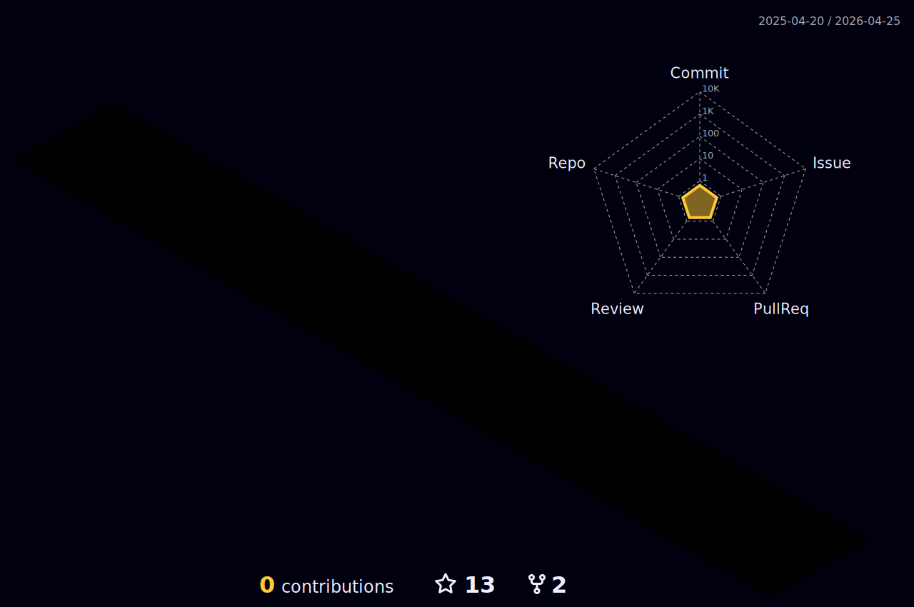

## Welcome to my Github 👋

  
세상을 아름답게 만드는 컴퓨터비전 엔지니어 ✨

 
 

## 🏃‍♀️ Career

- 포디리플레이코리아 영상처리 엔지니어
- 한국과학기술연구원 컴퓨터비전 연구원 
- 부스트캠프 AI Tech 6기

## 🚩 Project
[영상포트폴리오](https://www.youtube.com/watch?v=UHcJUVo3ez8) 
### Computer vision
- [멀티 카메라 영상 흔들림 보정](https://github.com/HeynaPark/PostStabilUI) 
- [영상 흔들림 실시간 보정](https://github.com/HeynaPark/FeatureTrack-Stabilize)
- [3차원 그래픽 알고리즘](https://github.com/HeynaPark/DrawIn3D)

### AI
- [단안 카메라 충돌 예측 시스템](https://github.com/boostcampaitech6/level2-3-cv-finalproject-cv-12)
- [Object Detection](https://github.com/boostcampaitech6/level2-objectdetection-cv-12)
- [OCR](https://github.com/boostcampaitech6/level2-cv-datacentric-cv-12)

    
## 💻 Programing stacks
 
 Languages :  
 
  
  

 Frameworks, Platforms and Libraries :  
  
  
  
  
  
  

  IDE :  
  
  
  
  
  

  OS :  
  
  

  Tools :    
  
  
  

  
  Version Control :  
  
  
  
    

 
 

    
  
  
  
  

contact : 📧ponmoa9305@gmail.com
